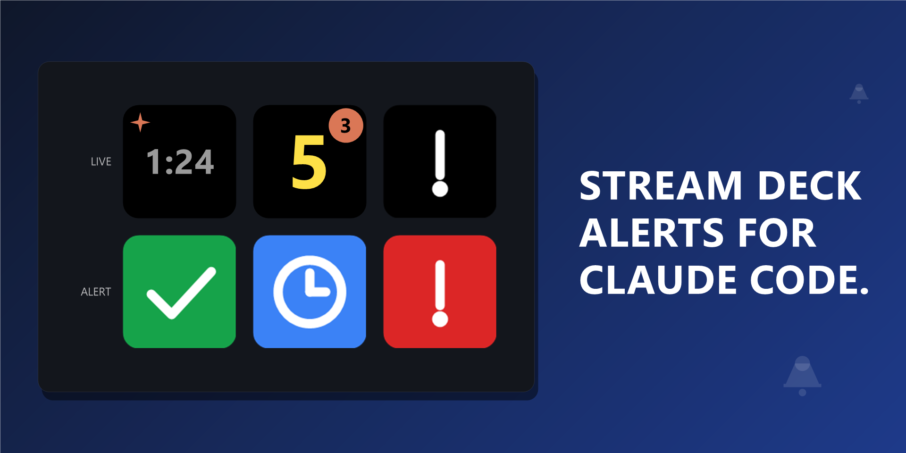

# Agentic Hooks — Stream Deck plugin

Flash a Stream Deck button on Claude Code hook events (turn end, permission request, task completed). Runs on Windows and macOS; remote Claude sessions work over SSH from any POSIX host.



> **Beta — pre-1.0.** This is the first public release of Agentic Hooks. Expect rough edges; please report issues at [github.com/nshopik/agentichooks/issues](https://github.com/nshopik/agentichooks/issues). The plugin is distributed via GitHub Releases (not Elgato Marketplace) until 1.0.

> **macOS support is experimental.** The Windows install path is the tested one; macOS code paths exist (afplay, system sounds, hook installer) but have not yet been validated end-to-end on a real Mac. Bug reports from Mac users are very welcome.

## Features

- Auto-clear when you reply: a `UserPromptSubmit` hook dismisses any active alert as soon as you start typing back to Claude.
- Static or pulsing flash mode, configurable per button.
- Optional audio cue per event. Stop and Permission default to system sounds (`Speech On.wav` / `Windows Message Nudge.wav` on Windows; `Glass.aiff` / `Funk.aiff` on macOS). Task Completed has no default sound — silent unless you pick a file.
- Works for remote Claude sessions via SSH reverse tunnel — your local deck flashes when Claude finishes on a remote machine.

## Install from Release

1. Go to [github.com/nshopik/agentichooks/releases/latest](https://github.com/nshopik/agentichooks/releases/latest).
2. Download `com.nshopik.agentichooks.streamDeckPlugin`.
3. Double-click the file. Stream Deck imports it.
4. Add one (or more) of the **On Stop**, **On Permission**, or **On Task Completed** actions from the "Agentic Hooks" category to keys. Configure (optional) audio in the Property Inspector.
5. Download the hook installer for your platform from the same release page and run it:
   - Windows: download `install-hooks.ps1` then run `powershell -ExecutionPolicy Bypass -File .\install-hooks.ps1`
   - macOS / Linux: download `install-hooks.sh` then run `bash install-hooks.sh`
6. (Migration only — skip unless you previously installed from the `claudenotify` repo): remove any `~/.claude/settings.json` hook entries that contain `"_claude-notify-installer": "v7"` before running the new installer, to avoid duplicate hook firings.

## Build from Source

```
git clone https://github.com/nshopik/agentichooks
cd agentichooks
npm install
npm run build
npx streamdeck link com.nshopik.agentichooks.sdPlugin
```

After linking, run the hook installer (Quick Start section below) to wire up Claude Code hooks for your local environment.

## Quick Start

**Local on Windows.** Run the installer to add the 15 Claude hooks to `~/.claude/settings.json`:

```powershell
powershell -ExecutionPolicy Bypass -File .\install-hooks.ps1
```

**Local on macOS.** Run the POSIX installer (also used for remote hosts; it points at `localhost:9123` by default):

```bash
bash install-hooks.sh
```

Both installers are idempotent — safe to run multiple times.

**Remote (Linux/macOS).** Add a reverse-forward to `~/.ssh/config` on the machine running the Stream Deck plugin:

```
Host my-dev-vm
  HostName dev-vm.example.com
  User you
  RemoteForward 9123 127.0.0.1:9123
```

SSH in and verify the tunnel:

```bash
curl -i http://localhost:9123/health
```

Expected: `HTTP/1.1 200 OK`. Then add hooks to the remote's `~/.claude/settings.json` matching the route table below — each hook is `curl -s --max-time 1 -X POST http://localhost:9123/event/<route> >/dev/null 2>&1 &` under the appropriate Claude hook key.

## HTTP routes

The listener accepts 15 routes. URL paths mirror Claude hook names: `/event/post-tool-use` ↔ `PostToolUse`, `/event/user-prompt-submit` ↔ `UserPromptSubmit`, etc.

| Route | Effect |
|---|---|
| `/event/stop` | arms `stop`; clears `permission`, `task-completed` |
| `/event/stop-failure` | arms `stop`; clears `permission`, `task-completed` |
| `/event/permission-request` | arms `permission` |
| `/event/task-completed` | arms `task-completed`; clears `permission` |
| `/event/session-start` | clears `stop`, `permission`, `task-completed` |
| `/event/user-prompt-submit` | clears `stop`, `permission`, `task-completed` |
| `/event/permission-denied` | clears `permission` |
| `/event/post-tool-use` | clears `permission` |
| `/event/post-tool-use-failure` | clears `permission` |
| `/event/pre-tool-use` | clears `stop` |
| `/event/notification` | log-only |
| `/event/post-tool-batch` | log-only |
| `/event/subagent-start` | log-only |
| `/event/subagent-stop` | log-only |
| `/event/task-created` | log-only |

`GET /health` returns `200 OK`.

## Configuration

Per-button settings are exposed in the Property Inspector and self-describing.

Plugin-global settings (More Actions → plugin settings):

- **Audio per event** — sound file. Stop and Permission default to system sounds; Task Completed has no default. Set the path to empty (Mute button) to silence an event without removing the configured sound.
- **Alert delay per event** — seconds between an arming hook and the alert firing. Default `1 s`. Set to `0` to fire immediately.
- **▶ Test** — plays the configured sound.

## Alert delay window and clear matrix

An arming hook enters a "pending" state for the configured delay (default 1 s); any clearing hook arriving inside that window cancels the pending alert with no sound and no flash. Repeat arms of the same event type during the pending window are no-ops — the original timer keeps running, never extended. This guards against fast `PermissionRequest → PostToolUse` races where a tool resolves in well under a second.

| Armed event | Cleared by | Auto-timeout default |
|---|---|---|
| `stop` | `Stop` (re-arm), `StopFailure` (re-arm), `PreToolUse`, `UserPromptSubmit`, `SessionStart`, manual press | 0 (no timeout) |
| `permission` | `Stop`, `StopFailure`, `TaskCompleted`, `PermissionRequest` (re-arm), `UserPromptSubmit`, `SessionStart`, `PermissionDenied`, `PostToolUse`, `PostToolUseFailure`, manual press | 0 (no timeout) |
| `task-completed` | `Stop`, `StopFailure`, `TaskCompleted` (re-arm), `UserPromptSubmit`, `SessionStart`, manual press, auto-timeout | 30,000 ms |

`Stop` (or `StopFailure`) ends a turn, so it dismisses both `permission` and `task-completed`. `TaskCompleted` clears `permission` because tool resolution implies the permission was settled. `PreToolUse` clears `stop` because the agentic loop has restarted without user input (auto-continue, `/continue`, compact-and-continue).

## Debug logging

Set `AGENTIC_HOOKS_DEBUG=1` and restart the plugin to raise log level from `warn` to `info`. Logs land in `%APPDATA%\Elgato\StreamDeck\Plugins\com.nshopik.agentichooks.sdPlugin\logs\com.nshopik.agentichooks.0.log` (newest is `.0`).

## Development

Standard npm scripts (`test`, `build`, `dev`, `typecheck`, `pack`); see `package.json`.

## License

MIT
