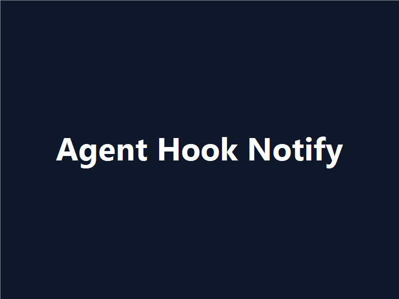

# Claude Notify — Stream Deck plugin

Flash a Stream Deck button on Claude Code hook events (turn end, permission request, task completed). Works for local Claude on Windows and remote Claude over SSH.



## Features

- One configurable Stream Deck action: place it as many times as you want, configure each instance for a single event type.
- Three events covered: **Stop** (Claude finished a turn), **Permission** (Claude wants approval), **Task Completed** (Claude finished a task — self-clears after 30s).
- Auto-clear when you reply: a `UserPromptSubmit` hook dismisses any active alert as soon as you start typing back to Claude — the deck doesn't keep glowing after you've already responded.
- Static or pulsing flash mode, configurable per button.
- Optional audio cue per event, defaulting to Windows system sounds, configurable per-event volume.
- Works for remote Claude sessions via SSH reverse tunnel — your local deck flashes when Claude finishes on a remote machine.

## Installation

### Option A — install built `.streamDeckPlugin` (release)

1. Download the latest `.streamDeckPlugin` from the [releases page](https://github.com/nshopik/claudenotify/releases).
2. Double-click the file. Stream Deck software installs the plugin.

### Option B — build from source (development)

```
git clone https://github.com/nshopik/claudenotify
cd claudenotify
npm install
npm run build
npx streamdeck link com.nshopik.claudenotify.sdPlugin
```

## Quick Start — Local (Windows)

### Install plugin

Choose Option A (download) or Option B (build) above, then:

```powershell
npx streamdeck link com.nshopik.claudenotify.sdPlugin
```

### Add Claude hooks

Run the provided installer to add hooks for the 9 action events plus 6 info events to `~/.claude/settings.json`:

```powershell
powershell -ExecutionPolicy Bypass -File .\install-hooks.ps1
```

The script is idempotent — safe to run multiple times. See [Local hook installation](#local-hook-installation-windows) below for details and troubleshooting.

## Local hook installation (Windows)

Install the Claude hooks that signal the plugin (9 action events plus 6 info events):

```
powershell -ExecutionPolicy Bypass -File .\install-hooks.ps1
```

The script edits `~/.claude/settings.json` additively, marks each added hook with a versioned tag for idempotency, and upgrades older marker versions in place. Each hook is a single `curl.exe` POST to `http://127.0.0.1:9123/event/<route>` — no sig files, no toasts.

## Quick Start — Remote (Linux/macOS)

### Configure SSH reverse-forward

Edit `~/.ssh/config` on your **Windows** machine and add this Host entry:

```
Host my-dev-vm
  HostName dev-vm.example.com
  User you
  RemoteForward 9123 127.0.0.1:9123
```

Replace `my-dev-vm`, `dev-vm.example.com`, and `you` with your actual values. Then SSH to the remote and verify the tunnel:

```bash
curl -i http://localhost:9123/health
```

Expected: `HTTP/1.1 200 OK`.

### Add hooks to remote machine

On the remote machine, add these hooks to `~/.claude/settings.json` under the `"hooks"` key:

```json
"Stop": [
  { "hooks": [
    { "type": "command",
      "command": "curl -s --max-time 1 -X POST http://localhost:9123/event/stop >/dev/null 2>&1 &",
      "async": true }
  ]}
],
"StopFailure": [
  { "hooks": [
    { "type": "command",
      "command": "curl -s --max-time 1 -X POST http://localhost:9123/event/stop-failure >/dev/null 2>&1 &",
      "async": true }
  ]}
],
"PermissionRequest": [
  { "hooks": [
    { "type": "command",
      "command": "curl -s --max-time 1 -X POST http://localhost:9123/event/permission-request >/dev/null 2>&1 &",
      "async": true }
  ]}
],
"TaskCompleted": [
  { "hooks": [
    { "type": "command",
      "command": "curl -s --max-time 1 -X POST http://localhost:9123/event/task-completed >/dev/null 2>&1 &",
      "async": true }
  ]}
],
"UserPromptSubmit": [
  { "hooks": [
    { "type": "command",
      "command": "curl -s --max-time 1 -X POST http://localhost:9123/event/user-prompt-submit >/dev/null 2>&1 &",
      "async": true }
  ]}
],
"SessionStart": [
  { "hooks": [
    { "type": "command",
      "command": "curl -s --max-time 1 -X POST http://localhost:9123/event/session-start >/dev/null 2>&1 &",
      "async": true }
  ]}
],
"PermissionDenied": [
  { "hooks": [
    { "type": "command",
      "command": "curl -s --max-time 1 -X POST http://localhost:9123/event/permission-denied >/dev/null 2>&1 &",
      "async": true }
  ]}
],
"PostToolUse": [
  { "hooks": [
    { "type": "command",
      "command": "curl -s --max-time 1 -X POST http://localhost:9123/event/post-tool-use >/dev/null 2>&1 &",
      "async": true }
  ]}
],
"PostToolUseFailure": [
  { "hooks": [
    { "type": "command",
      "command": "curl -s --max-time 1 -X POST http://localhost:9123/event/post-tool-use-failure >/dev/null 2>&1 &",
      "async": true }
  ]}
]
```

Test a Claude task on the remote — the Stop event should fire and your local Stream Deck button should flash. See [Remote setup](#remote-setup-linux--macos) below for detailed troubleshooting.

## Remote setup (Linux / macOS)

When Claude Code runs on a remote machine you reach via SSH, its hooks can flash buttons on your local Stream Deck — identical behaviour to local Claude.

### How it works

The plugin on your Windows machine listens for HTTP POSTs on `127.0.0.1:9123`. Each Claude hook on the remote machine is a one-line `curl` to its own `localhost:9123`. SSH is configured with a *reverse* port-forward (`-R 9123:127.0.0.1:9123`), so the remote's `localhost:9123` is tunneled back through SSH to your Windows machine's listener. Nothing is exposed publicly; the SSH tunnel is the only path in.

### Prerequisites

- The Claude Notify plugin is installed and running on your Windows machine.
- HTTP listener is enabled in the plugin's global settings (default: enabled, port 9123).
- You can SSH into the remote machine.
- `curl` is available on the remote (default on every mainstream Linux/macOS distribution).
- The remote's sshd allows `RemoteForward` (default — `AllowTcpForwarding yes`).

### Setup — once per remote host

**Step 1. Add a reverse-forward to your local SSH config**

Edit `~/.ssh/config` on your **Windows** machine (`C:\Users\<you>\.ssh\config`) and add:

```
Host my-dev-vm
  HostName dev-vm.example.com
  User you
  RemoteForward 9123 127.0.0.1:9123
```

For all hosts, use `Host *`. To do it ad-hoc, prepend `-R 9123:127.0.0.1:9123` to your `ssh` command.

**Step 2. Add the hooks to the remote's `~/.claude/settings.json`**

```json
{
  "hooks": {
    "Stop": [
      { "hooks": [
        { "type": "command",
          "command": "curl -s --max-time 1 -X POST http://localhost:9123/event/stop >/dev/null 2>&1 &",
          "async": true }
      ]}
    ],
    "StopFailure": [
      { "hooks": [
        { "type": "command",
          "command": "curl -s --max-time 1 -X POST http://localhost:9123/event/stop-failure >/dev/null 2>&1 &",
          "async": true }
      ]}
    ],
    "PermissionRequest": [
      { "hooks": [
        { "type": "command",
          "command": "curl -s --max-time 1 -X POST http://localhost:9123/event/permission-request >/dev/null 2>&1 &",
          "async": true }
      ]}
    ],
    "TaskCompleted": [
      { "hooks": [
        { "type": "command",
          "command": "curl -s --max-time 1 -X POST http://localhost:9123/event/task-completed >/dev/null 2>&1 &",
          "async": true }
      ]}
    ],
    "UserPromptSubmit": [
      { "hooks": [
        { "type": "command",
          "command": "curl -s --max-time 1 -X POST http://localhost:9123/event/user-prompt-submit >/dev/null 2>&1 &",
          "async": true }
      ]}
    ],
    "SessionStart": [
      { "hooks": [
        { "type": "command",
          "command": "curl -s --max-time 1 -X POST http://localhost:9123/event/session-start >/dev/null 2>&1 &",
          "async": true }
      ]}
    ],
    "PermissionDenied": [
      { "hooks": [
        { "type": "command",
          "command": "curl -s --max-time 1 -X POST http://localhost:9123/event/permission-denied >/dev/null 2>&1 &",
          "async": true }
      ]}
    ],
    "PostToolUse": [
      { "hooks": [
        { "type": "command",
          "command": "curl -s --max-time 1 -X POST http://localhost:9123/event/post-tool-use >/dev/null 2>&1 &",
          "async": true }
      ]}
    ],
    "PostToolUseFailure": [
      { "hooks": [
        { "type": "command",
          "command": "curl -s --max-time 1 -X POST http://localhost:9123/event/post-tool-use-failure >/dev/null 2>&1 &",
          "async": true }
      ]}
    ]
  }
}
```

These cover the 9 action routes that arm or dismiss buttons. The 6 info routes (`/event/notification`, `/event/pre-tool-use`, `/event/post-tool-batch`, `/event/subagent-start`, `/event/subagent-stop`, `/event/task-created`) are accepted by the listener but have no button effect today — omitting them from a remote config is safe.

`--max-time 1` keeps Claude unblocked if the tunnel is down; `&` makes the hook non-blocking; `>/dev/null 2>&1` suppresses output.

### Verify it works

After connecting (or reconnecting) to the remote with the reverse-forward in place:

**Check the tunnel** — from the remote shell:
```
curl -i http://localhost:9123/health
```
Expected: `HTTP/1.1 200 OK`. If you see `connection refused` or a timeout, the tunnel is not forwarding — see Troubleshooting.

**Fire a test event** — from the remote shell:
```
curl -X POST http://localhost:9123/event/stop
```
A button on your local Stream Deck configured for Stop should flash.

**Trigger a real Claude event** — run a short Claude task on the remote and wait for it to finish; the Stop hook fires, the deck flashes.

### Troubleshooting

| Symptom | Likely cause | Fix |
| --- | --- | --- |
| `curl: connection refused` from remote | SSH session opened without `-R`; or plugin not running on Windows; or HTTP listener disabled in plugin settings | Reconnect ensuring `-R 9123:127.0.0.1:9123` is set; verify plugin's global settings show "HTTP listener: listening on 127.0.0.1:9123" |
| Tunnel responds but deck doesn't flash | No button configured for that event type, or the button's event type is different | Open Property Inspector on a button, set Event type to match (Stop / Permission / Task Completed); use the per-button Test button to verify |
| `bind: Address already in use` warning when SSH connects | A previous SSH session to the same remote is still holding the reverse port | Disconnect the old session; or pick a different port (change plugin global setting + `-R` line + curl URLs to match) |
| `Permission denied` or "channel 3: open failed" on `-R` | Remote sshd has `AllowTcpForwarding no` (rare, hardened servers) | Ask sysadmin to enable; or use a different transport (out of scope) |
| `bash: curl: command not found` on remote | Minimal container/distro without curl | Install curl, or substitute the hook with `wget -q --tries=1 --timeout=1 --method=POST http://localhost:9123/event/stop -O /dev/null &` |
| Multiple concurrent Claude sessions to same remote, only one flashes | The `-R` reverse port can only be bound once per remote | Expected. Hooks from non-bound sessions silently fail (`--max-time 1` swallows the error). Use one Claude session per remote, or distinct ports per session |
| Plugin says HTTP listener "failed to bind" on Windows | Port 9123 is in use by something else on Windows | Change `httpPort` in plugin global settings; update `-R` line and remote curl URLs to match |
| WSL2 on the same Windows box | WSL2 default NAT means `localhost:9123` from inside WSL doesn't reach the Windows host | Use Windows 11 mirrored networking (`[wsl2] networkingMode=mirrored` in `.wslconfig`); or treat WSL like a remote and tunnel via SSH-to-WSL |

### What the plugin does *not* do

The plugin does not write to either machine's `~/.claude/settings.json`, does not establish the SSH tunnel for you, and does not modify your `~/.ssh/config`. All three are one-time manual setup steps owned by you.

## Configuration reference

### Per-button settings (Property Inspector)

- **Event type** — which Claude event this button reacts to (Stop / Permission / Task Completed). Default: Stop.
- **Icons** — set via Stream Deck's native two-dot state picker below the button preview. Each dot is a state (Idle / Alert). Click a dot's icon dropdown to **Set from File**, **Create New Icon**, or **Open Stream Deck Icon Library**. The plugin ships with a default idle/alert pair; replace either as you like.
- **Flash mode** — Static (icon swap) or Pulse (toggle every N ms).
- **Pulse rate** — milliseconds between toggles when Pulse is selected. Min 100ms (Elgato's 10/sec key-update cap).
- **Auto-dismiss** — seconds. 0 = never auto-dismiss.
- **Test flash** — fires a synthetic alert on this button.

### Plugin-global settings (More Actions → plugin settings)

- **HTTP listener** — toggle + port (default 9123).
- **Audio per event** — sound file (defaults to system WAVs), volume %.
- **▶ Test** — plays the configured sound at the configured volume.

### When alerts clear

Each armed alert button clears on a specific set of events — never on unrelated activity. The dispatcher arms only the matching slot per event; other event types' alerts stay armed until their own clearing trigger fires.

| Armed event | Cleared by | Auto-timeout default |
|---|---|---|
| `stop` | `Stop` (re-arm), `StopFailure` (re-arm), `UserPromptSubmit`, `SessionStart`, manual press | 0 (no timeout) |
| `permission` | `Stop`, `StopFailure`, `PermissionRequest` (re-arm), `UserPromptSubmit`, `SessionStart`, `PermissionDenied`, `PostToolUse`, `PostToolUseFailure`, manual press | 0 (no timeout) |
| `task-completed` | `TaskCompleted` (re-arm), `UserPromptSubmit`, `SessionStart`, manual press, auto-timeout | 30,000 ms |

Notable consequence: a fresh `Stop` (or `StopFailure`) cross-dismisses any armed `permission` alert because turn-end makes a pending permission request stale. `task-completed` survives `Stop` and `Permission` events and clears only on session-boundary signals or its own 30 s timeout.

## Debug logging

The plugin defaults to `warn` log level — only errors and listener-bind problems land in the log. To see every received HTTP event (action + info routes), set the env var and restart:

```powershell
$env:CLAUDE_NOTIFY_DEBUG = "1"
npx streamdeck restart com.nshopik.claudenotify
```

Logs land in `%APPDATA%\Elgato\StreamDeck\Plugins\com.nshopik.claudenotify.sdPlugin\logs\com.nshopik.claudenotify.0.log` (newest is `.0`). To turn off:

```powershell
Remove-Item Env:CLAUDE_NOTIFY_DEBUG
npx streamdeck restart com.nshopik.claudenotify
```

## Development

```
npm install
npm test            # run vitest
npm run dev         # rollup watch mode
npm run typecheck   # tsc --noEmit
npm run build       # rollup -> com.nshopik.claudenotify.sdPlugin/bin/plugin.js
npm run pack        # streamdeck pack -> .streamDeckPlugin
```

## License

MIT
