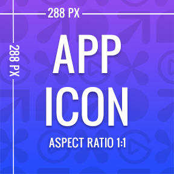
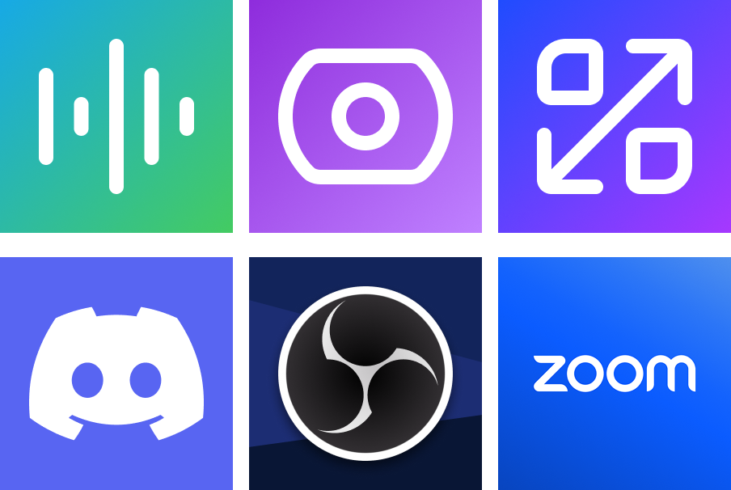
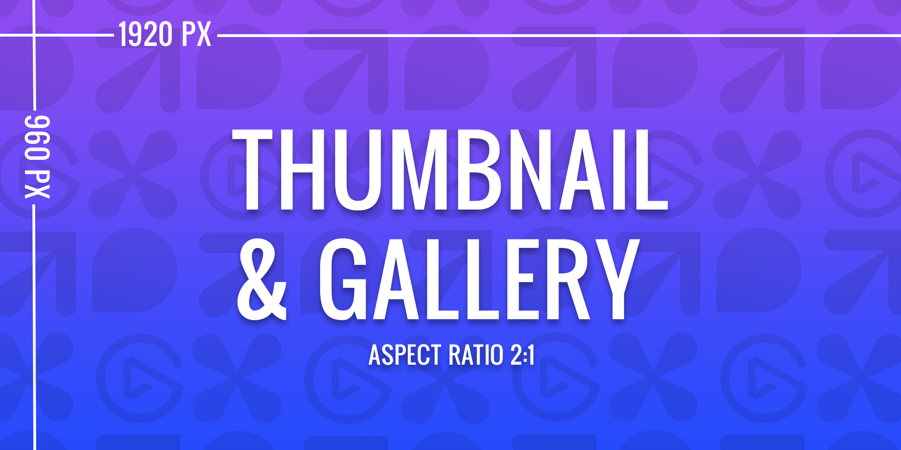
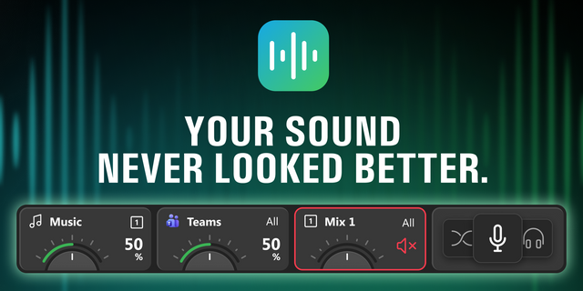
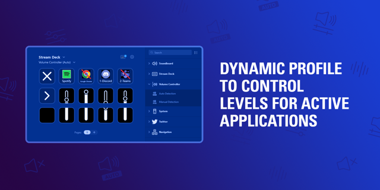
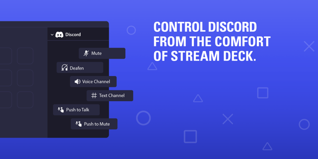
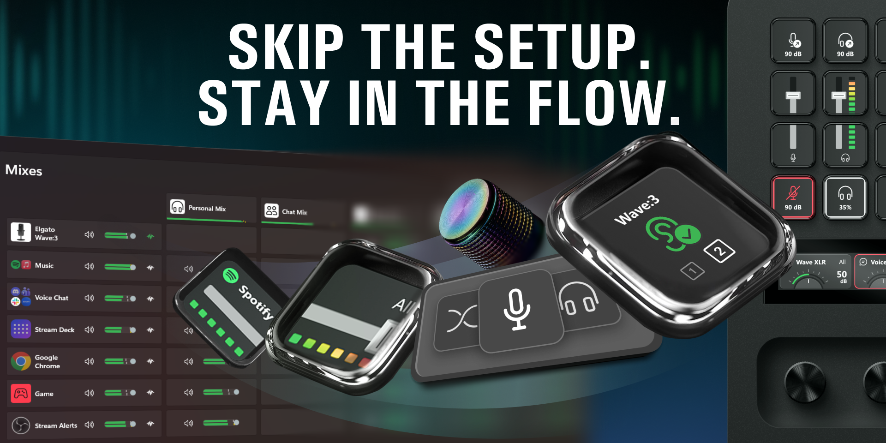
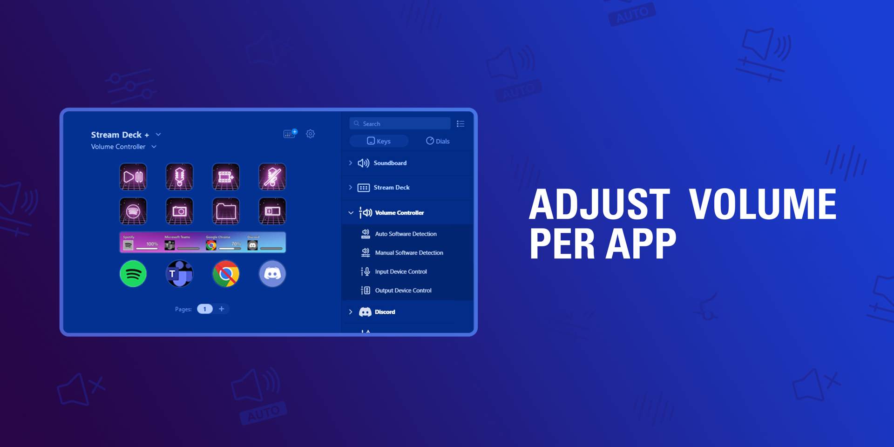
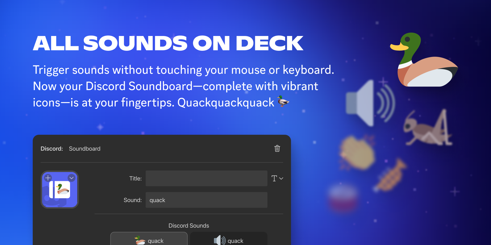

_Source: `Product Guidelines _ Marketplace.html` (Elgato Marketplace docs)._  
_Image references resolve relative to `Product Guidelines _ Marketplace_files/`._

---
# Product Guidelines

The guidelines on this page outline the standards for product names, descriptions, media, and metadata on Marketplace. Please review them carefully before submitting your product through Maker Console to ensure it meets all quality expectations.

On this page, you'll learn more about:

- Guidelines for your product's name and description.
- Image requirements, including app icons, thumbnails and gallery items.
- Examples of app icons, thumbnails, and gallery images.

Legal obligations

You **must** own the rights to any content you post on Marketplace. This includes the name, description, imagery, and content within the product files. It is your responsibility to ensure the legality of your product, and if at any point you are unsure you should consult a legal professional before submitting your product.

For further legal requirements, you can refer to the Maker Agreement which can be found within your organization's **Settings** page in Maker Console.

Change requests

We, Elgato, reserve the right to request changes to your product to ensure it conforms the necessary guidelines. Failure to do so may result in your Marketplace submission being declined, or your product being removed from Marketplace.

## Name[​](https://docs.elgato.com/guidelines/products/#name "Direct link to Name")

The name of your product is the primary identifier, allowing users to quickly find your product on Marketplace. Names also have an impact on off-site SEO results, and with some strategy and the right keywords, your name can help drive new customers from search engines such as Google and Bing.

Requirements

- **Do:** make your product name unique.
- **Do:** keep your product name short — ideally ≤30 characters.
- **Do:** follow [branding guidelines](https://docs.elgato.com/guidelines/branding) when referring to Elgato products.
- **Do:** capitalize the first letter.
- **Do:** capitalize proper nouns.
- **Do:** be provided in English — unless a product brand or trademark.

- **Don't:** infringe trademarks or copyright material.
- **Don't:** impersonate a similar product, or a product you do not own.
- **Don't:** include Maker name — your name will always be visible alongside your product. 1
- **Don't:** include price — phrases such as "Lite" and "Pro" etc. are fine.
- **Don't:** include product category when the product is a plugin, for example "Photoshop Plugin" or "Wave Link Plugin".
- **Don't:** use promotional or subjective words — cliché phrases such as "Top Quality", "Hot Item", "Best Seller", etc.
- **Don't:** use special characters and emojis.
- **Don't:** use plus (+) to denote "and" — for example, "Window Mover + Resizer" should be "Window Mover & Resizer".
- **Don't:** use exclamation points (!) for emphasis — stylization is fine, but must be limited to one.

1 special exceptions can be made when the product name is also the brand name.

Recommendations

- **Recommended:** when referring to trademarks or copyrighted material, use language such as "inspired by" or "from the world of", etc.
- **Recommended:** be relevant — your name should hint at what your product does.
- **Recommended:** be distinct — an original name helps your product stand out from others.
- **Recommended:** be creative — a creative title is both eye-catching and signals to customers that you put care and effort into your product.
- **Recommended:** be simple — avoid complex vocabulary; many users may not be fluent in English.
- **Recommended:** be memorable — the easier your name is to remember, the more customers will be able to recall it later when searching.

info

Should you need to change your product's name after creation, please contact us on [[maker@elgato.com](mailto:maker@elgato.com)](https://docs.elgato.com/guidelines/products/maker@elgato.com).

## Description[​](https://docs.elgato.com/guidelines/products/#description "Direct link to Description")

Description text is the secondary identifier for Marketplace internal search and your product's native SEO on the website. The first 250 characters carry the most weight and should clearly convey what your product does and who it is for. We recommend a minimum of 3 sentences to help maximize discoverability. The maximum character limit for descriptions is 1,500 characters.

Requirements

- **Do:** have a minimum of 250 characters, ~2–4 sentences.
- **Do:** include key words, features, actions and helpful information in your description.
- **Do:** list any requirements to use your product.
- **Do:** use unformatted text as part of the first 250 characters — this text is used as your description on search engines.
- **Do:** be provided in English.

- **Don't:** link users to outside paywalls in order to use your product.
- **Don't:** use random keywords at the end of your description.

Recommendations

- **Recommended:** mention the software name your product is inspired by or interacts with, such as Adobe Photoshop or Zoom.
- **Recommended:** use bullet points to reference actions, features or notable details about your product.
- **Recommended:** offer helpful tips on setup.

- **Not recommended:** use unhelpful filler text or long or ai-generated text that does not accurately describe your plugin.
- **Not recommended:** shorthand any keywords in your description.

## App Icon[​](https://docs.elgato.com/guidelines/products/#app-icon "Direct link to App Icon")

App icons are used for Stream Deck Plugins, and are shown when a user searches for products on Marketplace as well as on your product's details page.

App icon, 288 × 288 px.

Requirements

- **Do:** use PNG format.
- **Do:** provide an image that is 288 ×  288 px.
- **Do:** make the name or logo of your product the focus.
- **Do:** use a bold, readable font.

- **Don't:** make animations — thumbnails must be static PNG images.
- **Don't:** use copyrighted images that you do not own.
- **Don't:** use terms like "Official" in your images unless you are the IP owner.
- **Don't:** include text linking to external websites or social media.

### Examples[​](https://docs.elgato.com/guidelines/products/#examples "Direct link to Examples")

Examples of app icons on Marketplace, from top-left: Wave Link, Elgato Studio, Window Mover, Discord, OBS, Zoom.

## Thumbnails[​](https://docs.elgato.com/guidelines/products/#thumbnails "Direct link to Thumbnails")

Your product's thumbnail is shown throughout Marketplace, and should be eye-catching, relevant, and descript to entice the user.

Thumbnail and gallery images, 1920 × 960 px.

Requirements

- **Do:** use PNG format.
- **Do:** provide an image that is 1920 × 960 px.
- **Do:** accurately depict your product, and its functionality.
- **Do:** ensure all text is clear and legible.
- **Do:** ensure Elgato devices are accurate and true to the product.
- **Do:** use English for any text content.

- **Don't:** use imagery that you do not own the rights to.
- **Don't:** use low-quality screenshots to show-off your product.

**Examples**

Thumbnail for Wave Link on Marketplace.

Thumbnail for Volume Controller on Marketplace.

Thumbnail for Discord on Marketplace.

## Gallery[​](https://docs.elgato.com/guidelines/products/#gallery "Direct link to Gallery")

When listing a product on Marketplace, it's essential to make sure that the media gallery and preview requirements are met to present the product in the best possible way. This can help increase the chances of a successful sale.

Thumbnail and gallery images, 1920 × 960 px.

Requirements

- **Do:** provide 3 gallery items — products are required to have 3 gallery items, although you can have up to 10.
- **Do:** use PNG format for images and thumbnails size 1920 × 960 px.
- **Do:** use MP4 format for videos, size 1920 × 1080 and less than 250 MB.
- **Do:** accurately depict your product, and its functionality.
- **Do:** ensure all text is clear and legible.
- **Do:** ensure Elgato devices are accurate and true to the product.
- **Do:** ensure AI-generated images are high-quality and fully legible.
- **Do:** use English for any text content.

- **Don't:** use imagery that you do not own the rights to.
- **Don't:** use low-quality screenshots as gallery items.
- **Don't:** overuse text — text should be kept to a minimal; instead use the description field.
- **Don't:** copy another Maker's images.

Recommendations

- **Recommended:** show off customization options: If your product has different colors, variations, or other customization options, make sure to include images of each option. This will give customers a better idea of what the product looks like in different variations and can help them decide which one to purchase.
- **Recommended:** show detailed images of features: If your product has unique features or functions, make sure to highlight them in separate images. This will give customers a clear understanding of what the product can do and how it works.
- **Recommended:** include images of the User interface: If your product supports software or an application, include screenshots of the user interface. This will give customers an idea of the user experience and navigation.
- **Recommended:** show product in action: If possible, include images or videos of the product being used in real-world scenarios. This will help customers visualize how they might use the product and can be especially effective for products that are difficult to understand or explain through static images alone.

tip

Visit the [**Elgato Media Room**](https://www.elgato.com/us/en/s/media-room) for official media kit images.

**Examples**

Gallery image for Wave Link on Marketplace.

Gallery image for Volume Controller on Marketplace.

Gallery image for Discord on Marketplace.

## Pricing[​](https://docs.elgato.com/guidelines/products/#pricing "Direct link to Pricing")

Products may be listed on Marketplace as free or paid products; products are listed in your local currency, and are automatically converted to purchaser's currency at time of purchase.

Requirements

- **Do:** price match — when available on other platforms, the price of your product must match that of Marketplace.

- **Don't:** use external paywalls — while products may integrate with services that require external payment methods, access to the product must not depend on an external paywall or subscription.
- **Don't:** redirect users to 3rd party payment methods.

Recommendations

- **Recommended:** prefer consistent and standardized pricing values, such as $3.99 or $9.00.
- **Recommended:** "lite" versions — consider free and paid variants of your products to encourage adoption.

- **Not recommended:** irregular pricing, such as $3.23 or $8.74.

## Content Appropriateness[​](https://docs.elgato.com/guidelines/products/#content-appropriateness "Direct link to Content Appropriateness")

Elgato Marketplace is committed to an inclusive Marketplace.

- Your product should be suitable for a broad audience, with particular attention to protecting children from inappropriate content.
- Your product must be clearly labelled if it contains content that may not be suitable for certain audiences.
- Your product should be accessibility friendly.
- Your product and listing must not contain inappropriate, offensive, or discriminatory content.
- Your product and listing must be respectful of all users and cultures.
- Your product and listing must not be designed to cause users discomfort.

## Data & Security[​](https://docs.elgato.com/guidelines/products/#data--security "Direct link to Data & Security")

User privacy is protected by law, and you must follow all necessary requirements to ensure a user's data and system are kept safe and secure.

- Your product must not compromise user safety or device integrity; this includes avoiding software that could cause overheating, unauthorized shutdowns, or introduce harmful software, etc.
- Your product must have explicit user consent to collect analytical or personal identifiable data.
- Your product must incorporate necessary security measures to protect user data and prevent unauthorized access.
- As required by law, when collecting user identifiable data, you must provide user's with:

  - A privacy policy that clearly outlines the data being collected — this must be attached as an additional link to your product.
  - An easy way for them to request the deletion of said data.

## Legal[​](https://docs.elgato.com/guidelines/products/#legal "Direct link to Legal")

As a Maker publishing on Marketplace.

- Your product must comply with all legal requirements and Elgato's [policies](https://www.elgato.com/s/legal).
- You must own the rights and intellectual property of your product.
- You must not list products that infringe upon protected third-party material.
- You are responsible for ensuring your products comply with all local intellectual property laws.

If you believe a product infringes your intellectual property, or that of protected third-party material.

- You should reach out to the Maker first and attempt to resolve the dispute.
- If unsuccessful, you should file a [DMCA takedown request](https://airtable.com/appZZFEyqgCOY1wJn/shr44hhDbFFkv3FaX).

Elgato is committed to cooperating with law enforcement agencies and will take necessary actions when we believe there is a risk of physical harm or a threat to public safety.

Legal obligations

You **must** own the rights to any content you post on Marketplace. This includes the name, description, imagery, and content within the product files. It is your responsibility to ensure the legality of your product, and if at any point you are unsure you should consult a legal professional before submitting your product.

For further legal requirements, you can refer to the Maker Agreement which can be found within your organization's **Settings** page in Maker Console.
